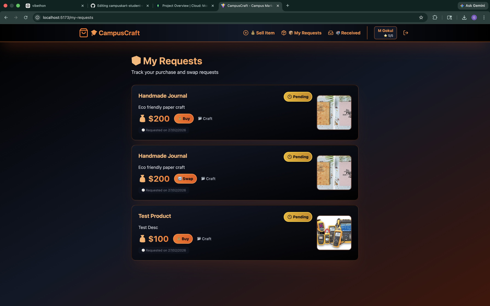
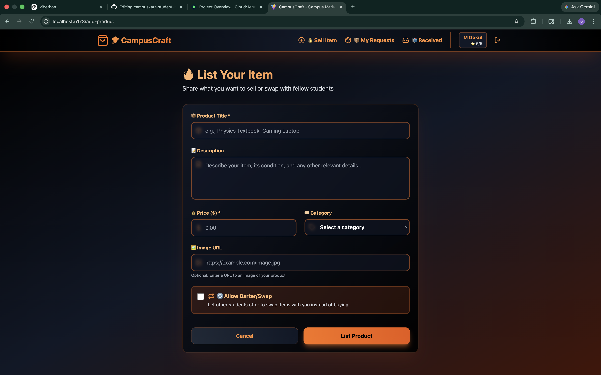

CampusKart – Student Marketplace Platform

A full-stack campus-exclusive e-commerce platform that enables students
to securely buy, sell, and exchange products and services within their
college ecosystem.

Key Features
College email-based authentication for secure access
Product listing with search and category filters
Buy and swap request
system with status tracking
Wallet-based transaction simulation
Trust system using user ratings

Features 
Authentication using JWT and college email validation
Product listing with images, pricing, and categories
Buy and swap
request system 
Seller rating and trust mechanism 
Responsive and clean UI

Tech Stack 
Frontend: React, Vite, TailwindCSS 
Backend: Node.js,Express.js 
Database: MongoDB 
Authentication: JWT

Installation and Setup

Backend
cd campuscraft-backend 
npm install 
npm start

Frontend 
cd campuscraft-frontend 
npm install 
npm run dev

API Endpoints

Authentication POST /api/auth/register POST /api/auth/login

Products GET /api/products POST /api/products/add

Requests POST /api/requests/create GET /api/requests/my-requests GET
/api/requests/received PUT /api/requests/status/:id

Project Structure ecom2/ ├── campuscraft-backend/ ├──
campuscraft-frontend/

Screenshots 

